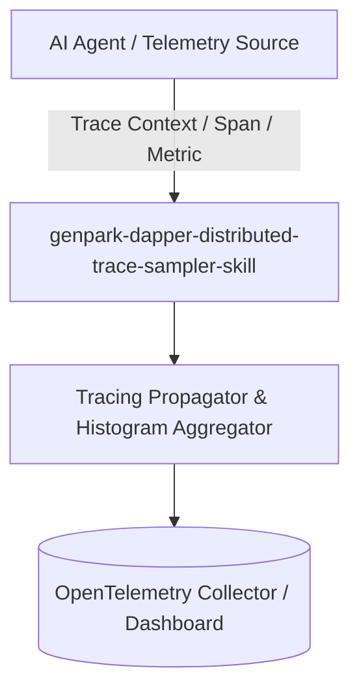

# genpark-dapper-distributed-trace-sampler-skill

[](https://github.com/alphaparkinc/genpark-dapper-distributed-trace-sampler-skill/actions)
[](https://opensource.org/licenses/MIT)
[](https://www.python.org/downloads/)

> Google Dapper style distributed trace sampler combining probabilistic head-based sampling with tail-based anomaly and error preservation.

## Architecture



## Features
- Pure standard library Python implementation with strictly zero pip dependencies.
- Production-grade telemetry principles (W3C traceparent, HdrHistogram, t-Digest, Dapper sampling).
- Native Model Context Protocol (MCP) server support for AI agent observability.

## Installation

```bash
git clone https://github.com/alphaparkinc/genpark-dapper-distributed-trace-sampler-skill.git
cd genpark-dapper-distributed-trace-sampler-skill
```

## Quickstart

```bash
python example_usage.py
```
